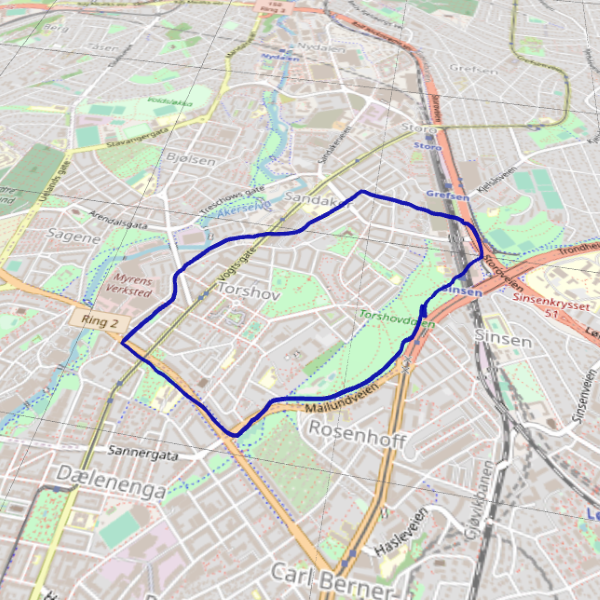

# Skydive3D

## About

Skydive3D is something like a GPX-path to ThreeJS environment converter.. tool.. thing. The idea is that you can import GPS data from a skydive and look at it in 3D.

Downloading of map tiles is done through OpenStreetMap. You should read through and follow their usage policy if you download tiles https://operations.osmfoundation.org/policies/tiles/.

## Quick start

```
$ python3 -m venv venv
$ . venv/bin/activate
$ pip install mercantile pillow utm
$ python osm2image.py --download 59.93554/10.77082
```

Something like this is printed:
```
NW location: 59.966009702748345/10.72265625
Width: 5040.294292219332, height: -4770.107384481467
```

Use the data from above:
```
$ mv merged.png html
$ echo -en "width = 5040;\nheight = 4770;\npoints = " > html/data.js
$ python gpx2json.py file.gpx 59.966009702748345/10.72265625 | jq 'map({"x": .x, "z": .z, "ele": .ele})' >> html/data.js
$ python3 -m http.server --directory html
$ firefox http://localhost:8000/
```

There is a sample data.js in example/data.js.

Screenshot:

